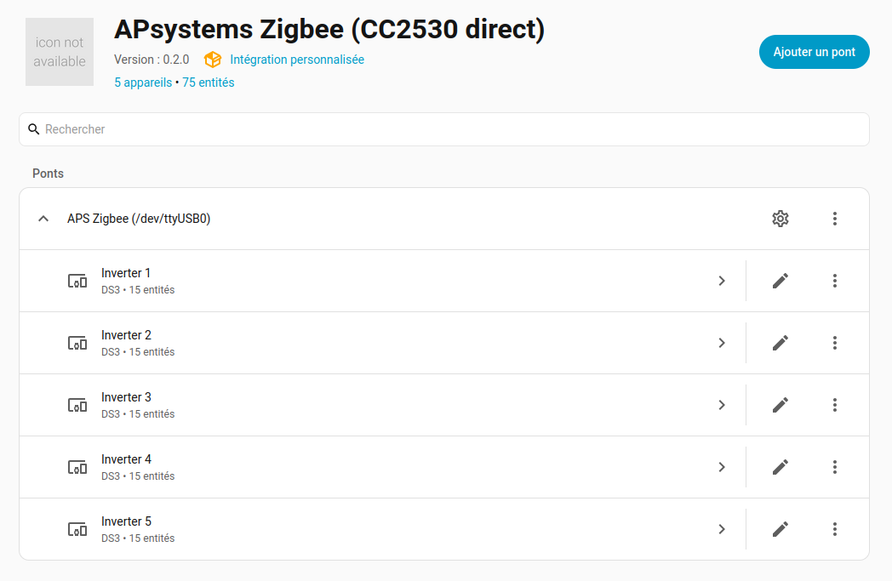
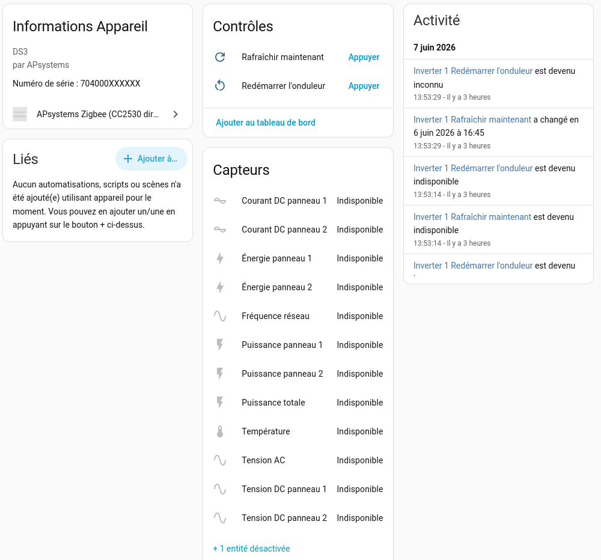

# APsystems DS3 — Home Assistant HACS plugin

Home Assistant custom component that talks **directly** to a CC2530 USB-serial
Zigbee dongle flashed with the proprietary **Kadsol** firmware
(`CC2530ZNP-with-SBL.hex`) to poll **APsystems DS3** micro-inverters. No ECU,
no cloud, no ESP32 bridge.

> **v0.2.0 — first HACS-ready release.** Install via HACS Custom
> Repositories (see [HACS install](#hacs-install) below). The repo lives
> on `main` (squash-merged from `develop`); active development continues
> on `develop` and lands as future tagged releases.



*The integration in Home Assistant after pairing 5 DS3 inverters — each
inverter is its own device with 15 entities, fed live by a single CC2530
dongle.*

---

## Why

APsystems DS3 micro-inverters speak a proprietary Zigbee dialect that ZHA and
Zigbee2MQTT do not understand. The widely-used
[`patience4711/ESP32-read-APS-inverters`](https://github.com/patience4711/ESP32-read-APS-inverters)
firmware solves it on an ESP32 + CC2530 combo and re-exposes the data over
MQTT/HTTP. This project ports that whole protocol stack to pure async Python
so you can plug the CC2530 module straight into your Home Assistant host —
the ESP32 disappears from the chain.

---

## Hardware shopping list

### 1. Zigbee module (mandatory)

A bare **CC2530 + CC2591** module is enough. Reference build used by the
author:

- [CC2530 + CC2591 module on AliExpress](https://fr.aliexpress.com/item/1005002387334208.html)
  (~ 5,40 €). The CC2591 is a PA/LNA front-end that gives ~100 m line-of-sight
  range — important when the inverters live in the roof and the host stays in
  the living room.

The module ships **blank** (Texas Instruments factory firmware) — you must
flash the Kadsol firmware before it can pair with APsystems inverters.

> ⚠️ The module is **not** a USB dongle. It is a 3.3 V serial peripheral. You
> will need a USB-TTL bridge for everyday use, and a one-shot programmer for
> the initial flash. See below.

### 2. USB-TTL bridge (mandatory, for everyday use)

Any 3.3 V USB-UART adapter works. Reference build:

- [CH340E USB Type-C adapter on AliExpress](https://fr.aliexpress.com/item/1005006603844179.html)
  (~ 2 €). Same `ch341` Linux driver as the classic CH340G, but with a
  USB-C connector — handier than the usual USB-A dongles. Verify the board
  exposes a **3.3 V** output (some CH340E breakouts default to 5 V; that
  would damage the CC2530).

Other tested chipsets:

- **CP2102** (Silicon Labs) — `cp210x` driver, ubiquitous on Linux.
- **CH340 / CH340G / CH9102** — `ch341` / `ch34x` driver.
- **FT232RL** (FTDI) — `ftdi_sio` driver.

What matters:

- Output **3.3 V logic** on TX/RX (most boards have a jumper for 3.3 V vs 5 V).
  Forcing 5 V on the CC2530 will damage it.
- The bridge enumerates as `/dev/ttyUSB*` on Linux. We map it into Home
  Assistant by its stable `/dev/serial/by-id/...` symlink.

### 3. Programmer (one-shot, for the initial flash)

A **~ 4–5 € ESP32-C3 dev board** from AliExpress. Native 3.3 V GPIOs
match the CC2530 logic level exactly — no level shifter, no USB-UART
adapter, no TI tooling. Compatible with any ESP32-C3 variant (DevKit M,
Super Mini, XIAO ESP32-C3, …); pinout is configurable in
`platformio.ini`.

The bundled standalone flasher at
[`tools/cc2530-flasher/`](./tools/cc2530-flasher/) is a PlatformIO
project that embeds the Kadsol firmware in the ESP32 binary. Once the
ESP32-C3 has the sketch, the rest is `pio device monitor`, type `FLASH`,
watch the LED turn green. Armed-mode protection: the CC2530 keeps
running normally unless you explicitly send `FLASH` on the serial
console, so an accidental ESP32 reboot can never wipe the dongle.

You only need the ESP32-C3 once for the initial flash — but if you
leave it wired permanently you can re-flash the CC2530 over SSH any
time. Step-by-step procedure below at **Step 2**.

> Other community paths exist (TI CC Debugger via
> [`cc-tool`](https://github.com/dashesy/cc-tool), Raspberry Pi GPIO via
> [`jmichault/flash_cc2531`](https://github.com/jmichault/flash_cc2531),
> Arduino + [`CCLib`](https://github.com/wavesoft/CCLib)) — they all
> drive the same CC2530 debug protocol. They are not documented in this
> repo because they have not been tested as part of this project; reach
> for them only if you already own and know the hardware.

### Bonus tip — CC2591 PA power rail

If you observe USB brownouts during the first CC2530 channel scan (the
dongle disappears from `dmesg` with `disconnect, errno -19` mid-init),
the CC2591 PA front-end is drawing more current than your USB-TTL bridge
can sustain on its built-in 3.3 V regulator. Wiring the CC2591's `VCC`
to an external 3.3 V rail — the **same ESP32-C3** you may already have
on the bench for flashing is a clean source — fixes it. Share `GND`
with the USB-TTL bridge so signals reference the same ground. The CH340E
bridge then only has to drive its UART pins, not the radio's peak
current.

---

## Wiring

For the **flashing wiring** (ESP32-C3 ↔ CC2530 debug pins) see
[`tools/cc2530-flasher/README.md`](./tools/cc2530-flasher/).

For **everyday operation** (USB-TTL ↔ module):

```
   USB-TTL 3.3 V                CC2530+CC2591 module
   ┌──────────┐                 ┌──────────────────┐
   │ VCC  3V3 │ ──────────►    │ VCC              │
   │ GND      │ ──────────►    │ GND              │
   │ TX       │ ──────────►    │ RX  (P0_2)       │
   │ RX       │ ◄──────────    │ TX  (P0_3)       │
   └──────────┘                 └──────────────────┘
```

Baud rate is 115 200 / 8N1 (hard-coded in the Kadsol firmware and in our
ZNP layer).

> ✋ Do **not** wire the USB-TTL `RTS` / `DTR` to the module's `RESET` pin
> unless you know what you are doing — some adapters pulse those at every
> port open and will reboot the dongle mid-poll.

---

## Flashing the Kadsol firmware

### Step 1 — Get the firmware

The Kadsol build is `CC2530ZNP-with-SBL.hex`. Convenient mirrors:

- [`patience4711/read-APSystems-YC600-QS1-DS3` → `cc25xx_firmware.zip`](https://github.com/patience4711/read-APSystems-YC600-QS1-DS3/blob/main/cc25xx_firmware.zip)
  — what the reference ESP32 firmware was built against.
- [Zigbee2MQTT community bundle](https://github.com/Koenkk/zigbee2mqtt/files/10193677/discord-09-12-2022.zip)
  — same file, more discoverable.

Extract the archive; you want the `.hex` file (not the `.bin` companion).

### Step 2 — Flash from an ESP32-C3 — *tested*

A ~ 4–5 € ESP32-C3 dev board acts as a software CC Debugger, with the
Kadsol firmware embedded directly in the ESP32 binary. No TI tools, no
CC Debugger, no Raspberry Pi.

The complete PlatformIO project is bundled in this repo at
[`tools/cc2530-flasher/`](./tools/cc2530-flasher/). Once the ESP32-C3
has the sketch, the rest is `pio device monitor`, type `FLASH`, watch
the LED turn green.

```
ESP32-C3                   CC2530 + CC2591
========                   ===============
GPIO 3   ───── 5 cm ─────► DD   (Debug Data)
GPIO 4   ───── 5 cm ─────► DC   (Debug Clock)
GPIO 5   ───── 5 cm ─────► RST  (Reset)
3V3      ───────────────► VCC  (3.3 V only — never 5 V)
GND      ───────────────► GND
```

```bash
pip install platformio        # or: pipx install platformio
cd tools/cc2530-flasher
pio run -t upload             # flashes the ESP32 over USB-CDC
pio device monitor            # 115200 baud — prompt waits for FLASH
# Type FLASH + Enter. Blue LED pulses during write/verify.
# Green LED solid = success. Red blink = failure (see serial output).
```

The ESP32-C3 boots in **armed mode** — its DD / DC / RST pins are
high-impedance until the `FLASH` command is received, so the CC2530
keeps running normally even with the ESP32 wired in permanently. A
useful side effect: if you leave the ESP32 in your install, you can
re-flash the CC2530 over SSH later (open `pio device monitor` from the
HA host).

See [`tools/cc2530-flasher/README.md`](./tools/cc2530-flasher/) for the
full reference (alternate ESP32 envs, pinout overrides, troubleshooting,
regenerating the embedded firmware blob from a different `.hex`).

### Step 3 — Verify

After flashing, disconnect the ESP32-C3's 3 V3 rail from the CC2530 (or
unwire it completely if you don't plan to leave it in for remote
re-flashing), connect the USB-TTL bridge for everyday operation, and
sanity-check the module from a terminal:

```bash
# Send a "ZB_READ_CONFIGURATION (item 0)" ping: FE 00 27 00 27
printf '\xFE\x00\x27\x00\x27' | sudo tee /dev/ttyUSB0 > /dev/null
sleep 0.5
sudo cat /dev/ttyUSB0 | xxd | head
```

A live dongle replies with a `FE 01 66 05 ...` packet. Silence means either
wrong wiring (RX/TX swapped) or wrong voltage on VCC.

---

## Validating the wiring (CLI, no Home Assistant required)

Before installing the integration in Home Assistant, validate every layer of
the stack from a terminal with the bundled diagnostic CLI. It only needs the
`pyserial-asyncio-fast` Python package — same one Home Assistant will use.

```bash
git clone git@github.com:technoo10201/ha-apsystems-ds3.git
cd ha-apsystems-ds3
python3 -m venv .venv
.venv/bin/pip install -r requirements.txt
# The wrapper auto-detects .venv and uses its Python.
./scripts/aps-cli --help
```

Six sub-commands. Run them in this order on first setup:

```bash
# 1. Spot your bridge — look for /dev/serial/by-id/usb-...CH340E...
./scripts/aps-cli list-ports

# 2. End-to-end health check: opens the port, runs the CC2530 init
#    sequence, pings the coordinator. Verdict: OK or FAIL.
./scripts/aps-cli doctor --port /dev/serial/by-id/usb-..._CH340E-if00

# 3. Pair an inverter by its 12-digit serial. Save the (serial, inv_id)
#    mapping to a JSON file so you can poll it later without retyping.
./scripts/aps-cli pair --port /dev/serial/by-id/usb-..._CH340E-if00 \
    --save inverters.json 408000158211

# 4. Poll once and check the values look plausible (DC ≈ 30–40 V,
#    AC ≈ 220–240 V, freq ≈ 50 Hz, temperature in a sane range).
./scripts/aps-cli poll --port /dev/serial/by-id/usb-..._CH340E-if00 3A10

# 5. Or run it in a loop every 60 s (Ctrl-C to stop). Useful before
#    leaving for the day to confirm the wiring is stable.
./scripts/aps-cli poll --port /dev/serial/by-id/usb-..._CH340E-if00 3A10 --loop
```

Two offline helpers that don't touch the hardware:

```bash
# Decode a captured frame to debug a value you don't trust.
./scripts/aps-cli decode 'FE0164010064FE034480001401D2...3969fefe'

# Or read it from a file (handy for long captures).
./scripts/aps-cli decode --from-file capture.hex
```

Add `--json` to any sub-command to get machine-readable output (useful for
piping into `jq`, automating a check, or sharing a frame for support).

Add `--debug` to see every ZNP frame transmitted and received on stderr —
this is what to attach to a bug report.

Once `doctor` says OK and a single `poll` returns sane values, the wiring is
sound and you can move on to the Home Assistant install.

---

## Installing the Home Assistant integration

> Don't want to risk breaking your production Home Assistant during
> development? Spin up a **disposable second instance** on port 8124 with
> [`docker/test-instance/`](./docker/test-instance/) — turnkey
> `docker compose` + `rsync` workflow that leaves your prod 8123 untouched.

### Manual install (works today)

Assuming Home Assistant Container (Docker) and the dongle plugged into the
host:

1. Find the stable serial path:
   ```bash
   ls -l /dev/serial/by-id/
   # e.g. /dev/serial/by-id/usb-Silicon_Labs_CP2102_USB_to_UART_Bridge_Controller-if00-port0
   ```
2. Make sure your Home Assistant container has access to it. In your
   `docker-compose.yml`:
   ```yaml
   services:
     homeassistant:
       devices:
         - /dev/serial/by-id/usb-Silicon_Labs_CP2102_USB_to_UART_Bridge_Controller-if00-port0:/dev/ttyUSB0
   ```
   Then `docker compose up -d`.
3. Copy `custom_components/aps_zigbee/` (this directory) into your HA
   config folder: `<HA-config>/custom_components/aps_zigbee/`.
4. Restart Home Assistant.
5. **Settings → Devices & Services → Add integration → APsystems Zigbee
   (CC2530 direct)**.

### HACS install

This repo ships as a **HACS Custom Repository** (not yet in the HACS
default list — that needs a separate PR cycle against
[`hacs/default`](https://github.com/hacs/default) and is on the roadmap
post-v0.2.0).

1. Open Home Assistant → **HACS** → top-right `⋮` menu → **Custom
   repositories**.
2. Paste the repo URL: `https://github.com/technoo10201/ha-apsystems-ds3`.
3. Pick category **Integration** → click **Add**.
4. The "APsystems Zigbee (CC2530 direct)" card appears in the HACS list.
   Open it → **Download** → confirm the latest version → wait for HACS
   to fetch.
5. Restart Home Assistant.
6. **Settings → Devices & Services → Add integration → APsystems Zigbee
   (CC2530 direct)** to start the config flow described above.

Future versions are picked up automatically by HACS once a new GitHub
Release is tagged on `main`. Read the release notes before upgrading —
breaking changes will be flagged there.

---

## Configuring

### Initial setup

The config flow asks for three things:

| Field | What | Default |
| --- | --- | --- |
| Serial port | The `/dev/serial/by-id/...` path of your USB-TTL bridge | dropdown of detected ports |
| ECU id | 12-hex-char identity the coordinator advertises to inverters | `D8A3011B9780` (matches the upstream firmware) |
| Polling interval | Seconds between poll cycles | `60` |

> If you have already paired inverters against an older
> `ESP32-read-APS-inverters` setup, **keep the same ECU id** as that firmware
> used (default `D8A3011B9780`) — otherwise the inverters won't recognise
> the new coordinator and you'll have to re-pair them.

### Adding inverters

After setup, open **Settings → Devices & Services → APsystems Zigbee → Configure**:

- **Pair a new inverter**: enter the 12-digit serial printed on the inverter,
  add an optional friendly name. The Zigbee handshake runs live against the
  dongle; success persists the pairing in the config entry.
- **Forget a paired inverter**: remove it from the list.
- **Polling interval**: change the cycle without re-pairing.

You can also automate pairing via the service `aps_zigbee.pair_inverter`
(see **Developer Tools → Services**).

---

## Entities exposed



*One inverter's device page in HA: device info (model, manufacturer,
serial), the **Refresh now** and **Reboot inverter** controls, and the
full sensor list. Values show `Indisponible` at night — the inverter is
unpowered (no sun, no PV), which is normal — see
[Night-time behaviour](#night-time-behaviour) below.*

For each paired inverter the integration creates a device with up to 13
entities:

| Entity | Unit | Device class | State class |
| --- | --- | --- | --- |
| `DC voltage panel 1/2` | V | voltage | measurement |
| `DC current panel 1/2` | A | current | measurement |
| `Power panel 1/2/total` | W | power | measurement |
| `Energy panel 1/2` | kWh | energy | total_increasing |
| `AC voltage` | V | voltage | measurement |
| `Grid frequency` | Hz | frequency | measurement |
| `Temperature` | °C | temperature | measurement |
| `Zigbee signal quality` | % | — | measurement (disabled by default) |
| `Mesh hops` | — | — | measurement (diagnostic, disabled by default) |

Energy uses `total_increasing` so the **Energy** dashboard handles
inverter-side resets automatically.

The `Power total` sensor carries three extra attributes you can use in
templates / automations:

- `state` — one of `ok` / `stale` / `idle` / `dead` (see *Night-time behaviour*
  below for the semantics).
- `last_seen` — ISO timestamp of the last successful poll.
- `consecutive_failures` — daytime failure streak; reset to zero on success
  and at sunrise.

**Mesh hops** is the honest alternative to a "distance" reading (Zigbee has
no time-of-flight ranging, and per-frame LQI only describes the last radio
hop). It counts the relays between the inverter and the dongle — `0` means a
direct radio link — and its `route` attribute lists the relay inverters by
name, straight from the source-route announcements the dongle's firmware
emits while polling. A hop count that grows or a route that changes daily is
your early warning that the mesh is struggling.

### Per-inverter buttons

In addition to the sensors, each device exposes two buttons:

- **Refresh now** — bypass the polling interval and the backoff window to
  poll *this* inverter immediately. Useful when you want a fresh reading
  without waiting (e.g. before reading the value in an automation).
- **Reboot inverter** — send the proprietary reboot command. Same effect
  as the `aps_zigbee.reboot_inverter` service, but scoped to the device
  card in the UI.

---

## Night-time behaviour

APsystems DS3 micro-inverters power themselves directly from the PV panels:
no sun, no power, no Zigbee chatter. **This is by design**, observed and
documented by `patience4711` in the upstream ESP32 firmware project. An
inverter that goes silent overnight is not a fault.

The integration uses your Home Assistant location (`sun.sun`) to suppress
the "inverter dead" detection while the sun is below the horizon:

- During the day, after **5 consecutive failed polls** an inverter is marked
  `dead` — its sensors go *unavailable* and a real fault is signalled.
- During the night, failures don't count toward that threshold and the
  inverter's `state` attribute stays `idle`. Sensors keep their last daytime
  values, available but stale, until sunrise.
- At sunrise, the failure counter is reset so morning warm-up gets a fresh
  five chances.

If you have no location configured in Home Assistant, the `sun.sun` entity
won't exist and the integration falls back to treating every poll attempt as
daytime — you'll see false "dead" alarms overnight. Configure your
latitude/longitude under **Settings → System → General** to avoid that.

---

## Resilience features

These are running silently in the background, but worth knowing about when
debugging.

- **Exponential backoff per inverter.** A failing inverter is retried with
  increasing delays (1 s, 2 s, 4 s, 8 s, … capped at 5 min) instead of
  hammered every cycle.
- **Coordinator watchdog.** Every 5 min, if no successful polling cycle was
  recorded in that window, the integration pings the CC2530 directly. If the
  dongle doesn't answer, a full coordinator recovery (close → reopen →
  re-init) runs with its own backoff schedule (5 s, 30 s, 2 min, 10 min).
- **Hot-plug recovery.** When the USB-TTL bridge is unplugged, the next read
  or write surfaces as a clean `ZNPError`, the transport is marked closed,
  and the watchdog re-opens the port at the next tick. Plug it back in and
  the polling resumes within a minute, no Home Assistant restart needed.
- **Startup retry.** `async_setup_entry` retries the dongle bring-up three
  times (2 s apart) before failing with `ConfigEntryNotReady` — handy after
  a host reboot where the USB device takes a moment to enumerate.

---

## Services

| Service | Use |
| --- | --- |
| `aps_zigbee.pair_inverter` | Pair a new inverter (`serial`, optional `name`). |
| `aps_zigbee.repoll` | Force an immediate refresh cycle. |
| `aps_zigbee.reboot_inverter` | Send the proprietary reboot command (`serial`). |
| `aps_zigbee.discover` | Dump the dongle's neighbour + routing tables to the debug log. |
| `aps_zigbee.rebind_persistent` | Re-run the pair handshake in a loop (`serial`, `duration` min, `pause` s) until the inverter answers. |
| `aps_zigbee.cancel_rebind` | Stop the running persistent re-bind campaign. |

### Persistent re-bind

The pair handshake is the most demanding radio operation of the whole
protocol: the request broadcast is relayed by the mesh, but the inverter —
not yet a mesh member — can only answer **by direct radio**, single hop, to
the dongle. An inverter at the edge of that direct range may fail a one-shot
**Re-bind** every time, while still being perfectly pollable through the
mesh once bound.

A marginal link is not a constant, though: it fluctuates with PV output
(the inverter's transmitter is at its best at full production), weather and
multipath. `rebind_persistent` exploits that by sampling the channel — one
~20 s handshake cycle every `pause` seconds for up to `duration` minutes:

```yaml
service: aps_zigbee.rebind_persistent
data:
  serial: "408000158211"
  duration: 60      # minutes (default 30, max 240)
  pause: 60         # seconds between attempts (default 60)
```

Polling of the other inverters keeps running between attempts, the watchdog
stays quiet, and you get a persistent notification when the campaign ends —
success (the stored short address is updated automatically) or expiry.
Best started around solar noon. If several campaigns on different days all
fail, the link budget verdict is final: pair once with the dongle
physically next to the inverter, then move it back (the binding survives,
and the mesh relays the polling afterwards).

---

## Troubleshooting

| Symptom | Likely cause | Fix |
| --- | --- | --- |
| `Cannot open the serial port` | Wrong path, or another integration grabbed it. | Confirm `/dev/serial/by-id/...` and that ZHA / Zigbee2MQTT is not pointing at the same dongle. |
| `CC2530 dongle did not come up` | Wrong firmware, wrong voltage, RX/TX swap. | Re-do step 3 of the flashing guide; verify 3.3 V on VCC. |
| `pairing_failed` for every inverter | Wrong ECU id, or inverter out of range. | Use `D8A3011B9780` unless you know what you changed; move the dongle closer to validate range first. |
| Energy sensor never increases at night | Normal — the inverter is off and the timestamp doesn't move. | Expected; check during daylight. |
| Power jumps to a huge value right after restart | The first sample after restart has a stale "previous" reading. | The coordinator handles inverter-side resets but a HA restart resets *our* state; one polling cycle later the values are correct. |
| `state` attribute is `idle` | Sun is below the horizon — normal night-time behaviour. | Wait for sunrise; the inverter will resume on its own. |
| `state` attribute stays `dead` during the day | Real loss of Zigbee link (range, dead inverter, dongle issue). | Check `signal_quality` history; move the dongle closer; press **Reboot inverter** in the device card; failing that, re-pair. |
| Warning `answered with serial X, expected Y` | Two inverters have their (serial ↔ invID) mappings swapped — typically a mix-up during manual invID entry. Their data would otherwise be silently cross-attributed. | Remove **both** inverters from the integration, then re-add each with the invID the warning reports for its serial. |
| Poll always fails with `AF_DATA_CONFIRM did not succeed` | The short address doesn't exist on the mesh — stale manual invID (e.g. from an old pairing) or the inverter never joined this network. | Run a real pair handshake: **Re-bind**, `rebind_persistent` at full sun, or pair once with the dongle next to the inverter. |
| All inverters go silent at the same time | Coordinator wedged (firmware lock-up) or USB-TTL bridge unplugged. | The watchdog will recover automatically within 5 min. Speed it up by reloading the integration. |

Enable verbose protocol logs:

```yaml
# configuration.yaml
logger:
  default: warning
  logs:
    custom_components.aps_zigbee: debug
    custom_components.aps_zigbee.aps_protocol: debug
```

---

## How it works (architecture)

```
┌──────────────────────────────────────────────────────────────┐
│ Home Assistant (Docker container)                            │
│  ┌───────────────────────────────────────────────────────┐   │
│  │ custom_components/aps_zigbee/                         │   │
│  │  ├─ config_flow.py   ← UI: pick port, ECU id, pair    │   │
│  │  ├─ coordinator.py   ← DataUpdateCoordinator          │   │
│  │  ├─ sensor.py        ← 13 SensorEntity per inverter   │   │
│  │  └─ aps_protocol/    ← pure Python (HA-free)          │   │
│  │      ├─ znp.py        ZNP framing + async serial      │   │
│  │      ├─ frames.py     proprietary command builders    │   │
│  │      ├─ coordinator.py CC2530 init sequence           │   │
│  │      ├─ pairing.py    APS 4-command pairing handshake │   │
│  │      ├─ polling.py    poll request + response gates   │   │
│  │      └─ decode_ds3.py field offsets + scaling         │   │
│  └───────────────────────────────────────────────────────┘   │
│                       │ pyserial-asyncio-fast                │
└───────────────────────┼──────────────────────────────────────┘
                        │ /dev/serial/by-id/...
                ┌───────▼────────┐
                │ USB-TTL bridge │ (CP2102 / CH340 / FT232RL)
                └───────┬────────┘
                        │ 115200 / 8N1 / 3.3 V
                ┌───────▼─────────────┐
                │ CC2530 + CC2591     │ ← Kadsol firmware
                │ (Zigbee coordinator) │
                └───────┬─────────────┘
                        │ proprietary APS Zigbee
                ┌───────▼───────┐  ┌─────────────┐  ┌─────────────┐
                │ DS3 inverter  │  │ DS3 inverter│  │ DS3 inverter│ ...
                │   (×N)        │  │             │  │             │
                └───────────────┘  └─────────────┘  └─────────────┘
```

The proprietary protocol is documented in
[`patience4711/ESP32-read-APS-inverters`](https://github.com/patience4711/ESP32-read-APS-inverters)
(see `ZIGBEE_*.ino` and `AAA_DECODE.ino`); we port it 1:1 to async Python.

---

## Development

```bash
git clone git@github.com:technoo10201/ha-apsystems-ds3.git
cd ha-apsystems-ds3
python3 -m venv .venv
.venv/bin/pip install -r requirements-dev.txt
.venv/bin/pytest          # 68 unit tests on the protocol layer
.venv/bin/ruff check .    # lint
.venv/bin/ruff format .   # format
```

The `aps_protocol/` package is deliberately HA-free so the protocol layer is
testable (and shippable, e.g. as a CLI) without pulling in `homeassistant`.
The bundled `scripts/aps-cli` wrapper exposes the protocol layer end-to-end
against a live dongle — see [Validating the wiring](#validating-the-wiring-cli-no-home-assistant-required)
above for the six sub-commands.

---

## Credits

- Protocol reverse-engineering and reference firmware:
  [patience4711/ESP32-read-APS-inverters](https://github.com/patience4711/ESP32-read-APS-inverters)
  and [patience4711/read-APSystems-YC600-QS1-DS3](https://github.com/patience4711/read-APSystems-YC600-QS1-DS3).
- CC2530 ZNP firmware: **Kadsol**, distributed through the Zigbee2MQTT
  community.

---

## License

MIT — see [`LICENSE`](LICENSE).
